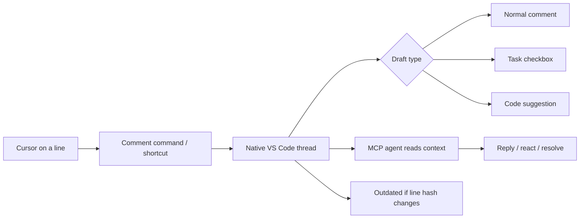

# Fix My Comments

**A local code-comment collaboration layer for VS Code and AI agents.**

Add native VS Code comment threads on code lines, switch each draft between a normal comment, task, or code suggestion, let AI agents reply through MCP, and keep everything stored locally per repository and branch.

> **Status: early development.** The extension and MCP server are evolving together; storage currently lives outside the repo under `~/.fixmycomments/`.

---

## What It Does

Put your cursor on a line and start a thread:

```ts
function calculateTotal(items: Item[]) {
  return items.reduce((sum, item) => sum + item.price, 0);
}
```

Then choose the type of reply you want:

- 💬 **Normal comment** — regular discussion.
- 📝 **Task** — checkbox item that can be completed later.
- 💡 **Suggestion** — replacement code for the current line.

Agents connected through the `fix-my-comments-mcp` server can discover open threads, read only the message context they need, reply, post suggestions, react with emoji, resolve/reopen threads, and check off task messages.

If the anchored line changes, the thread is marked **outdated** so agents do not act on stale comments by accident.

---

## Quick Start

Fix My Comments has two parts:

1. **The VS Code extension** — the editor UI that creates and displays native comment threads.
2. **The `fix-my-comments-mcp` server** — exposes those threads to AI agents (Claude Code, Cursor, etc.) over the [Model Context Protocol](https://modelcontextprotocol.io/).

Both read and write the same data, stored under `~/.fixmycomments/<repo>-<hash>/<branch>/` — so nothing is committed into your project, and your branches can carry different notes.

### 1. Install the extension

The extension is in early development. To run it today, build from source (see the [Contributing guide](CONTRIBUTING.md)); a Marketplace release is planned.

### 2. Install the MCP server globally

```bash
npm install -g fix-my-comments-mcp
```

This installs the `fix-my-comments` command on your PATH.

### 3. Connect it to Claude Code

Run this in your terminal — it registers the server once for all your projects:

```bash
claude mcp add fix-my-comments --scope user -- fix-my-comments
```

Verify it connected:

```bash
claude mcp list
```

You should see `fix-my-comments` listed as **✔ Connected**.

> **Run the server from inside your repo.** The server derives its storage path from your current directory and Git branch, so launch Claude Code from the project root — not your home folder — so comments map to the correct repository and branch.

<details>
<summary>Using a different agent (Cursor, Windsurf, custom)?</summary>

The server is a plain stdio MCP server whose command is `fix-my-comments`. Point your agent's MCP config at that command, run from inside your repo. See the [MCP server README](https://github.com/duraisamy-gokul/fix-my-comments-mcp#readme) for details.

</details>

---

## Key Features

| Feature                           | Description                                                                                                      |
| --------------------------------- | ---------------------------------------------------------------------------------------------------------------- |
| **Native VS Code comments**       | Uses `vscode.comments`, so threads feel like normal editor comments instead of a custom webview.                 |
| **Single-line code anchors**      | Threads attach to a line, follow line shifts during editing, and become outdated if that line's content changes. |
| **Comment / task / suggestion**   | Draft helpers let you post normal comments, checkbox tasks, or replacement-code suggestions.                     |
| **Suggestion draft prefill**      | Suggestion mode highlights the current line and pre-fills it into the comment input for quick edits.             |
| **Emoji reactions**               | Users and agents can react to messages with emoji.                                                               |
| **Resolve and task checkboxes**   | Threads can be resolved/reopened, and task messages can be checked off.                                          |
| **AI-agent MCP contract**         | Agents can list threads, fetch message windows, reply, suggest, react, and update status through MCP.            |
| **Stale-comment protection**      | Outdated threads are filtered/blocked by default so agents avoid stale comments.                                 |
| **Local & branch-scoped storage** | Data lives under `~/.fixmycomments/`, keyed by repo + branch — nothing is committed to your project.             |
| **Tasks sidebar**                 | A VS Code activity-bar view lists current threads and jumps back to the source line.                             |

---

## How It Works



**Single-line anchoring.** Each thread stores a workspace-relative file path, zero-based line number, a short SHA-256 hash of that line's text, and the original snippet. Line numbers shift with edits during an editor session; if the line's content changes, the thread is marked outdated.

**Branch-scoped storage.** Thread data lives under `~/.fixmycomments/<repo>-<hash>/<branch>/`, shared byte-for-byte with the MCP server. Threads and messages are stored separately, so agents can append replies without rewriting the whole thread list.

See the full design in **[docs/product-plan.md](docs/product-plan.md)**.

---

## Documentation

- [Product design & data model](docs/product-plan.md)
- [Roadmap](docs/roadmap.md)
- [Sub-product plans](plans/README.md)

---

## Contributing

This project is built in the open, one small pull request at a time. If you want to contribute — local setup, scripts, project structure, code style, testing, and the claim flow are all in the **[Contributing guide](CONTRIBUTING.md)**.

---

## License

MIT
