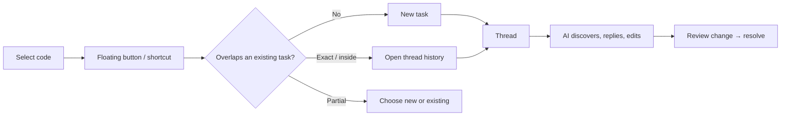

# Fix My Comments

**An AI-powered task and collaboration layer that lives directly on top of your code — inside VS Code.**

Select code. Attach a task. Discuss it with AI agents. Let them resolve it. Review the changes. Keep the full history — all without leaving the editor, and all stored locally per repository and branch.

> **Status: early development.** Phase 0 (project scaffold, tooling, CI hooks, planning) is complete. The features below describe the product being built across the [roadmap](docs/roadmap.md). This is the place to contribute from the ground up.

---

## Why This Extension

Code review tools live in the browser. TODOs rot inside comments. Notes-to-self live in scattered files that drift out of sync with the code they describe. And when an AI agent changes your code, the _reasoning_ behind the change is lost the moment the chat window closes.

Fix My Comments fixes that by making the **task** a first-class object attached to a **piece of code**:

- It rides along with the code as it moves, gets refactored, or is reformatted.
- It holds a full conversation — you and any number of AI agents.
- It records exactly what an AI changed, why, and lets you accept or reject it.
- It lives locally, scoped to your repository and current Git branch, so your branches can carry different notes.

Think **GitHub Issues + code review threads + AI agents**, collapsed into the editor and pinned to the exact lines they're about.

---

## What It Does

You select a method:

```java
public User getUser(Long id) {
   ...
}
```

A floating button appears. You create a task:

> _"Refactor this method and reduce duplication."_

That task is now **anchored** to those lines. Later:

- An AI agent discovers the open task, refactors the code, and posts a reply explaining what changed.
- You review the diff inline and **accept**, **reject**, or **request changes**.
- The task moves to `resolved` — and the whole thread is preserved.
- If the code moves or gets reformatted, the task follows it. If the code is deleted, the task is marked `orphaned` rather than silently lost.

---

## Key Features

| Feature                     | Description                                                                                                                    |
| --------------------------- | ------------------------------------------------------------------------------------------------------------------------------ |
| **Code-anchored tasks**     | Attach a task to a selection, a whole file, or the entire repository.                                                          |
| **Durable anchoring**       | Tasks survive edits, formatting, and line moves via text-hash + context recovery — not fragile line numbers.                   |
| **Floating action button**  | Select code and a button appears at the cursor; a configurable keyboard shortcut does the same.                                |
| **Smart selection routing** | Re-selecting anchored code opens its history; partial overlap lets you choose new vs. existing; exact match jumps straight in. |
| **AI-named threads**        | Every thread is automatically given a short, descriptive name by AI.                                                           |
| **Conversation threads**    | GitHub-style threads with messages from you and any AI agent, preserved forever.                                               |
| **AI change preview**       | See files and ranges an AI modified, review a diff, and accept / reject / request changes.                                     |
| **Provider-agnostic AI**    | Works with Claude, Codex, ChatGPT, Gemini, Cursor, Windsurf, or custom agents — no provider is hardcoded.                      |
| **Local & branch-scoped**   | Data is stored in local extension storage keyed by repo + branch — nothing is committed to your project.                       |
| **Git-aware**               | Designed to follow file renames, branch switches, and merges.                                                                  |
| **Built to scale**          | Targets 10,000+ tasks, large monorepos, and multi-root workspaces with incremental indexing.                                   |

---

## How It Works

### Selection → Task → Thread



### Durable Anchoring

Tasks never depend on line numbers alone. Each anchor stores the selected text, a content hash, and the surrounding lines, and recovers its location in stages:

`exact hash → exact text → context match → (future) AST & semantic match → orphaned`

### Local, Branch-Scoped Storage

Task data is **not** committed into your repository. It lives in VS Code's extension storage, keyed by `repository root + Git branch`. The model separates a lightweight **task record** from append-only **thread** and **history** logs, so posting a reply appends one record instead of rewriting the task — fast at scale and friendly to your editor.

See the full design in **[docs/product-plan.md](docs/product-plan.md)**.

---

## Roadmap

The product is built in ordered phases, each a self-contained sub-product. Contributors pick subtasks within a phase and ship them as individual PRs.

`Done`: `1` = done, `0` = not done.

| Phase | Sub-product                                                           | Done |
| ----- | --------------------------------------------------------------------- | ---- |
| 0     | Repository Initialization                                             | 1    |
| 1     | [Local Task System](plans/phase-1-local-task-system/00-overview.md)   | 0    |
| 2     | [Durable Anchoring](plans/phase-2-durable-anchoring/00-overview.md)   | 0    |
| 3     | [Thread View](plans/phase-3-thread-view/00-overview.md)               | 0    |
| 4     | [AI Agent Contract](plans/phase-4-ai-agent-contract/00-overview.md)   | 0    |
| 5     | [AI Change Preview](plans/phase-5-ai-change-preview/00-overview.md)   | 0    |
| 6     | [Git-Aware Recovery](plans/phase-6-git-aware-recovery/00-overview.md) | 0    |
| 7     | [Scale & Marketplace](plans/phase-7-scale-marketplace/00-overview.md) | 0    |

Full roadmap with diagrams and progress tracker: **[docs/roadmap.md](docs/roadmap.md)**.

---

## Documentation

- [Product design & data model](docs/product-plan.md)
- [Roadmap](docs/roadmap.md)
- [Sub-product plans](plans/README.md)
- [Contributing guide](CONTRIBUTING.md)

---

## Contributing

This project is built in the open, one small PR at a time. Work is organized as:

```text
Roadmap → Phase (sub-product) → Subtask → Pull Request → Mark done
```

Each subtask is a GitHub Issue. To avoid collisions, **claim before you code** — comment on the issue and open a draft PR with `Closes #X` so your claim is visible. Multiple contributors can work within the same phase by picking different subtasks.

New here? Read the **[contributing guide](CONTRIBUTING.md)**, then [pick a subtask from the roadmap](docs/roadmap.md). It covers local setup, scripts, type generation, code style, and the claim flow.

---

## License

MIT
