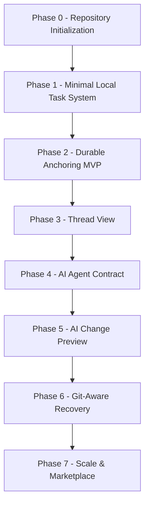
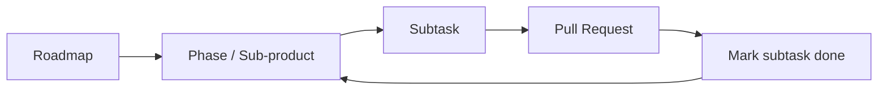

# Fix My Comments Roadmap

This is the master roadmap. It breaks the product into ordered **phases** (sub-products). Each phase contains **subtasks**, and each subtask is meant to be one focused pull request / commit. Multiple contributors can work inside the same phase at the same time by picking different subtasks.

- Product vision and detailed design: [product-plan.md](./product-plan.md)
- Per-phase sub-product plans: [`/plans`](../plans)
- How to contribute: [CONTRIBUTING.md](../CONTRIBUTING.md)

`Done`: `1` = done, `0` = not done.

## Roadmap Overview

## How the Roadmap Maps to Work

- **Roadmap** → the whole product, this file.
- **Phase** → one sub-product plan in `/plans`. One phase = one milestone.
- **Subtask** → one checklist item inside a phase. One subtask = one PR / commit.
- A phase is complete when all its subtasks are checked off.

## Phases

### Phase 0 — Repository Initialization

TypeScript VS Code extension scaffold, linting, formatting, build, pre-commit hooks, and initial docs.

Plan: complete (this repository).

### Phase 1 — Minimal Local Task System

Create tasks from selected code, persist them under `~/.fixmycomments/<repo>-<hash>/<branch>/` (home directory root, scoped by repo + branch), and show them in the sidebar with basic gutter decorations.

Plan: [`plans/phase-1-local-task-system`](../plans/phase-1-local-task-system/00-overview.md)

### Phase 2 — Durable Anchoring MVP

Anchor tasks to code using text hash and context so they survive edits, formatting, and line moves. Detect orphaned tasks and relocate anchors after recovery.

Plan: [`plans/phase-2-durable-anchoring`](../plans/phase-2-durable-anchoring/00-overview.md)

### Phase 3 — Bitbucket-style Thread View

A custom webview thread panel where the user reads and replies to a task, posts and **applies suggestions** (Bitbucket-style diffs), changes status, and navigates back to the anchored code. AI auto-names threads. This replaces the earlier native Comments-panel approach for full review fidelity.

Plan: [`plans/phase-3-thread-view`](../plans/phase-3-thread-view/00-overview.md)

### Phase 4 — AI Agent Contract (MCP)

A provider-agnostic contract (the `fix-my-comments-mcp` package) so any AI agent can discover open tasks, post replies and suggestions, record execution metadata, and update status. Includes a "Connect AI Agent" flow that gives the user both the terminal install command and a `.mcp.json` snippet.

Plan: [`plans/phase-4-ai-agent-contract`](../plans/phase-4-ai-agent-contract/00-overview.md)

### Phase 5 — AI Change Preview

Track files and ranges changed by an AI agent and review them with accept / reject / request-changes, with inline highlighting of AI-modified code.

Plan: [`plans/phase-5-ai-change-preview`](../plans/phase-5-ai-change-preview/00-overview.md)

### Phase 6 — Git-Aware Recovery

Refresh comments on branch switch (watch `.git/HEAD`), detect file renames via Git, and use Git history as an extra anchor-recovery signal. Comments are strictly per-branch (no cross-branch history merging).

Plan: [`plans/phase-6-git-aware-recovery`](../plans/phase-6-git-aware-recovery/00-overview.md)

### Phase 7 — Scale & Marketplace

Indexing, search, tests, settings, error handling, packaging, and release pipeline for Marketplace readiness.

Plan: [`plans/phase-7-scale-marketplace`](../plans/phase-7-scale-marketplace/00-overview.md)

## Progress Tracker

| Phase | Sub-product                 | Done | Subtasks done      |
| ----- | --------------------------- | ---- | ------------------ |
| 0     | Repository Init             | 1    | —                  |
| 1     | Local Task System           | 1    | 9 / 9              |
| 2     | Durable Anchoring           | 1    | 7 / 8 (1 cut)      |
| 3     | Bitbucket-style Thread View | 0    | 1 / 7 (rebuilding) |
| 4     | AI Agent Contract (MCP)     | 0    | 4 / 6 (reworking)  |
| 5     | AI Change Preview           | 0    | 0 / 4              |
| 6     | Git-Aware Recovery          | 0    | 0 / 4              |
| 7     | Scale & Marketplace         | 0    | 0 / 6              |

When you finish a subtask, update its checkbox in the phase `checklist.md`, and update this table and the phase status above in the same or a follow-up PR.
