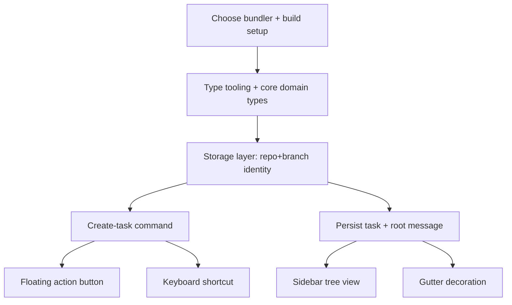

# Phase 1 — Minimal Local Task System

## Goal

Let a developer create a task from selected code, persist it under `~/.fixmycomments/<repo>-<hash>/<branch>/` (home directory root, scoped to repository + Git branch), and see it in the sidebar with a basic gutter indicator. No anchoring recovery, no AI, no thread UI yet — just the end-to-end skeleton with durable local storage.

## Scope

In scope:

- Local storage layer at the home directory root under `~/.fixmycomments/<repo>-<hash>/<branch>/`, keyed by repository root + Git branch. Data lives outside the source repo, so nothing is ever committed.
- Domain type tooling: author the type YAML + `gen:types` and generate the core types (task record, thread message, history event). Shapes are designed in [03-type-definitions.md](03-type-definitions.md).
- Create-task command from an editor selection.
- Floating action button on selection that triggers the command.
- A configurable keyboard shortcut for the same command.
- Persisting a task plus its root thread message (append-only log).
- Sidebar tree view grouped by status.
- A gutter decoration for lines that have an open task.

Out of scope (later phases):

- Durable anchor recovery and orphan detection (Phase 2).
- Thread panel and replies (Phase 3).
- AI agent contract (Phase 4).

## Subtask Breakdown

Each box maps to a subtask in [checklist.md](checklist.md). Subtasks with no dependency edge between them can be worked in parallel by different contributors.

## Build / Bundler Decision

Phase 0 uses `tsc` to compile to `dist/`. Before this phase ships UI, choose a bundler.

- **Recommended: esbuild.** It is the VS Code Marketplace standard for extension host code (Node/CommonJS target, `vscode` marked external, fast watch).
- `vite build` was suggested but targets browser/ESM apps; it is appropriate for webview UI (Phase 3) but not for the extension host entry point.

Decision to record in the bundler subtask: use esbuild for the extension host, and reserve vite for webview front-ends introduced in Phase 3. Keep `npm run check` green throughout.

## Acceptance Criteria

- Selecting code and triggering the command creates a task.
- The task and its root message are written to `~/.fixmycomments/<repo>-<hash>/<branch>/tasks.json` + `messages.json`, separated by repo + branch.
- The data lives outside the source repo (nothing is committed).
- Reopening VS Code on the same repo + branch shows the task again.
- The sidebar lists the task under the correct status section.
- A gutter marker appears on the anchored lines.
- `npm run check` passes.

## Dependencies

- Phase 0 (done).
- Type tooling (`types/*.yaml` + `gen:types` + `src/generated`) is introduced within this phase; see [03-type-definitions.md](03-type-definitions.md).
