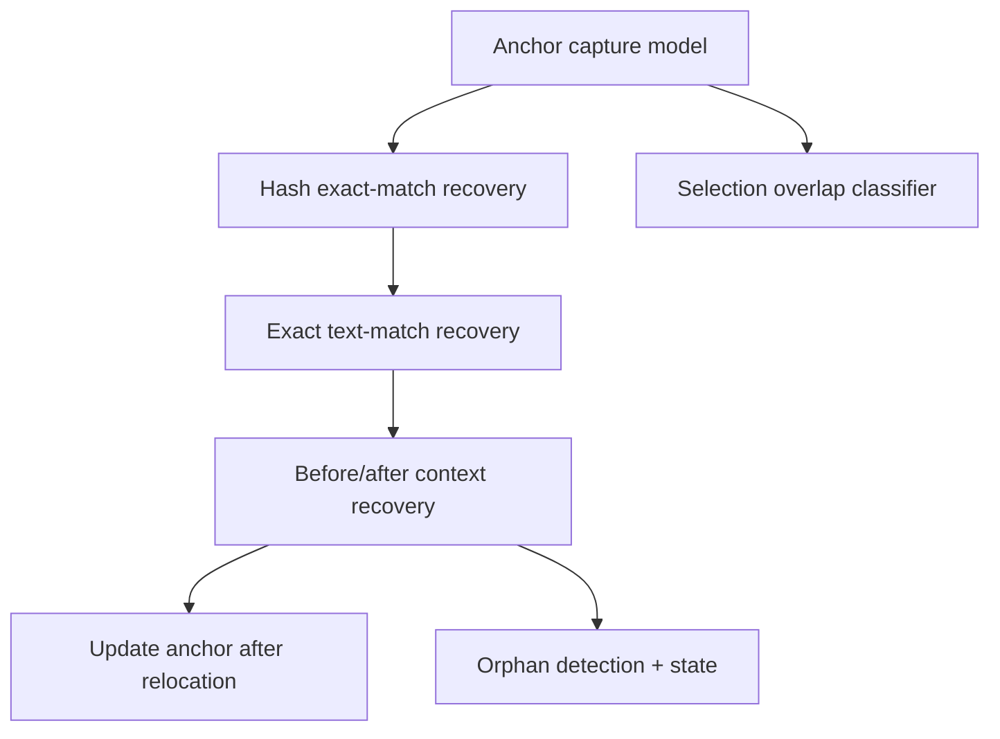

# Phase 2 — Durable Anchoring MVP

## Goal

Make tasks survive code edits. Anchor a task to its selection using a text hash and surrounding context, recover the anchor after changes, update it when the code moves, and mark it orphaned when recovery fails. Also implement the selection-overlap logic that decides between opening history and starting a new task.

## Scope

In scope:

- Anchor capture: selected text, text hash, char ranges, before/after context lines.
- Staged recovery: hash match → exact text → context match.
- Anchor update after successful relocation.
- Orphaned detection when recovery fails.
- Selection overlap classification: exact match, partial overlap, fully inside.

Out of scope:

- AST and semantic matching (later refinement).
- Git rename detection (Phase 6).

## Subtask Breakdown

## Acceptance Criteria

- Editing unrelated lines keeps the task attached.
- Reformatting or moving the selected block relocates the anchor and updates it.
- Deleting the selected code marks the task `orphaned`.
- Selecting the exact anchored range opens history; partial overlap prompts; fully-inside opens the containing task.
- `npm run check` passes.

## Dependencies

- Phase 1 (storage + task model).
