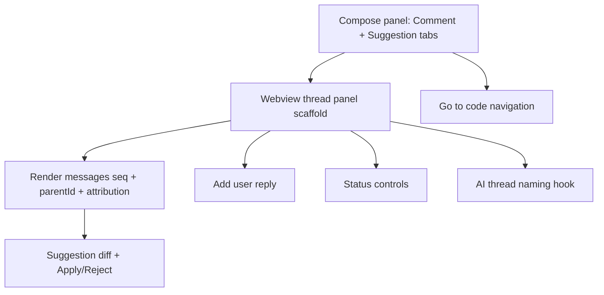

# Phase 3 — Bitbucket-style Thread View

## Goal

Give each task a custom webview conversation UI that feels like a GitHub/Bitbucket review thread. The user opens a thread, reads messages in order, replies, **posts and applies suggestions** (Bitbucket-style diffs), changes status, and jumps back to the anchored code. New threads are auto-named.

This phase **rebuilds** the earlier native Comments-panel implementation. The native panel could not express apply-able suggestions or AI attribution, so it is replaced by a custom webview.

## Scope

In scope:

- Custom webview thread panel (the host side owns the task/message store; the webview renders and posts actions back).
- Compose panel with **Comment** and **Suggestion** tabs (the `compose-panel.ts` work already started).
- Render messages in `seq` order with `parentId` threading and **AI/human author attribution** (badge + color for agents).
- Add a user reply (append to the thread log).
- **Suggestions**: render a suggestion message as a split diff (original → suggested) with **Apply** and **Reject** actions. Applying replaces the anchored range, records an `applied` state on the message + a history event, and re-anchors the task if line count changed.
- Status controls (resolve, reopen, block) on the thread header and sidebar.
- Go-to-code navigation from the panel and from the sidebar.
- AI thread-naming hook for new threads.

Out of scope:

- AI agent execution and change preview (Phases 4–5).
- AI-posted suggestions (the apply/reject UI is reusable, but agents arrive in Phase 4).

## Subtask Breakdown

## Suggestion lifecycle

A message with `messageType: "suggestion"` carries `suggestionCode` (the proposed replacement for the anchored range) and an optional `content` explanation.

- **Apply** — replace the anchored range with `suggestionCode` via a `WorkspaceEdit`, mark the message `applied`, append a `suggestion_applied` history event, and re-anchor the task if the line count changed.
- **Reject** — mark the message `rejected` and append a `suggestion_rejected` history event. No code changes.

Applied suggestions are rendered as a completed review timeline entry so the thread reads like a review.

## Acceptance Criteria

- Clicking a task in the sidebar opens the file, scrolls to the anchor, and opens the thread.
- Messages render in order; replies indent under their parent; AI authors are visually distinguished from humans.
- A user can post a comment reply that persists to the thread log.
- A user can post a suggestion from the compose panel; the thread shows a split diff with Apply/Reject.
- Applying a suggestion edits the file and marks the message applied; rejecting marks it rejected.
- Status changes are reflected in the sidebar and history log.
- New threads receive an AI-generated name.
- `npm run check` passes.

## Dependencies

- Phase 1 (tasks, sidebar), Phase 2 (anchor navigation + live ranges).
