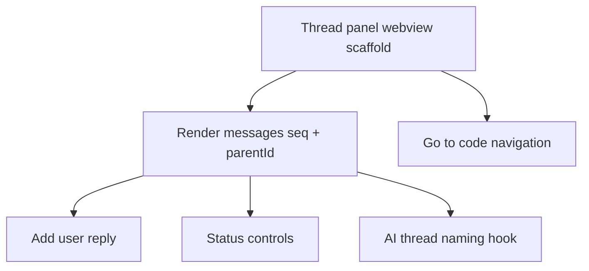

# Phase 3 — Thread View

## Goal

Give each task a conversation UI. The user opens a thread, reads messages in order, replies, changes status, and jumps back to the anchored code. New threads are auto-named by AI.

## Scope

In scope:

- Webview thread panel (this is where vite/webview front-end tooling fits).
- Render messages in `seq` order with `parentId` threading.
- Add a user reply (append to the thread log).
- Status controls (resolve, reopen, block).
- Go-to-code navigation from the panel and from the sidebar.
- AI thread-naming hook for new threads.

Out of scope:

- AI agent execution and change preview (Phases 4–5).

## Subtask Breakdown

## Acceptance Criteria

- Clicking a task in the sidebar opens the file, scrolls to the anchor, and opens the thread.
- Messages render in order, replies indent under their parent.
- A user can post a reply that persists to the thread log.
- Status changes are reflected in the sidebar and history log.
- New threads receive an AI-generated name.
- `npm run check` passes.

## Dependencies

- Phase 1 (tasks, sidebar), Phase 2 (anchor navigation).
