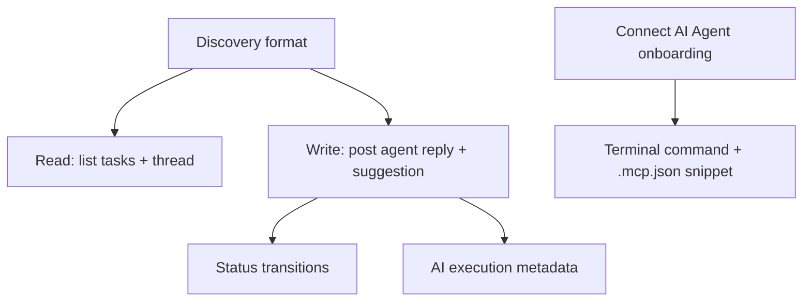

# Phase 4 — AI Agent Contract (MCP)

## Goal

Define a provider-agnostic contract (the **`fix-my-comments-mcp`** package) so any AI agent (Claude, Codex, Gemini, Cursor, Windsurf, custom) can discover open tasks, read threads, post replies **and suggestions**, record execution metadata, and update status — without hardcoding a single provider. Includes an in-extension "Connect AI Agent" onboarding flow.

## Architecture

The MCP server is a **separate, publishable npm package** (`fix-my-comments-mcp`), the single source of truth. The extension **does not** ship a duplicate server. Both the extension and the server read/write the same `.fixmycomments/<branch>/` storage, so the extension's storage layer and the server's file access must stay byte-compatible (same JSON shapes in `types/`).

## Scope

In scope:

- A documented, versioned discovery format for open tasks and threads.
- A read path: `list_open_tasks` (with optional `filePath` filter) and `get_task_thread`.
- A write path: `post_agent_reply` — appends a `TaskMessage` (`authorType: ai`), optionally a **suggestion** (`messageType: suggestion` + `suggestionCode`), and records an `AgentExecution`.
- Status transitions an agent may perform (`set_task_status`: `resolved` or `requires_review`), each appending a history event.
- AI execution metadata record (execution id, agent, timestamp, files, summary, reason).
- **Connect AI Agent** onboarding: a command that shows the user the terminal install command **and** a `.mcp.json` snippet, and explains both paths.

Out of scope:

- Diff preview UI (Phase 5).
- Built-in provider execution — the contract is provider-neutral; the user runs their own agent.

## Subtask Breakdown

## Connect AI Agent onboarding

The extension exposes a `fixMyComments.connectAgent` command that opens a webview (or quick-pick) explaining how to connect a coding agent. It gives the user **both** options:

1. **Terminal command** — run `claude mcp add fix-my-comments -- fix-my-comments` (or the equivalent for the user's agent), which installs the published `fix-my-comments-mcp` server.
2. **`.mcp.json` snippet** — a copy-pasteable snippet to drop into a project `.mcp.json`, since not every machine/setup supports the global command.

The server is always the npm package; the extension never embeds it.

## Acceptance Criteria

- An external agent can enumerate open tasks and read a thread via the contract.
- An agent can append a reply attributed to its name and type, including a suggestion.
- An agent can mark a task `resolved` or `requires_review`.
- Execution metadata is persisted and linked to the message.
- The contract is documented and versioned; no provider is hardcoded.
- The duplicate `src/mcp/server.ts` in the extension repo is removed; the npm package is the only server.
- `Connect AI Agent` shows both the terminal command and the `.mcp.json` snippet.
- `npm run check` passes in both repos.

## Dependencies

- Phases 1–3 (storage shapes the server depends on).
