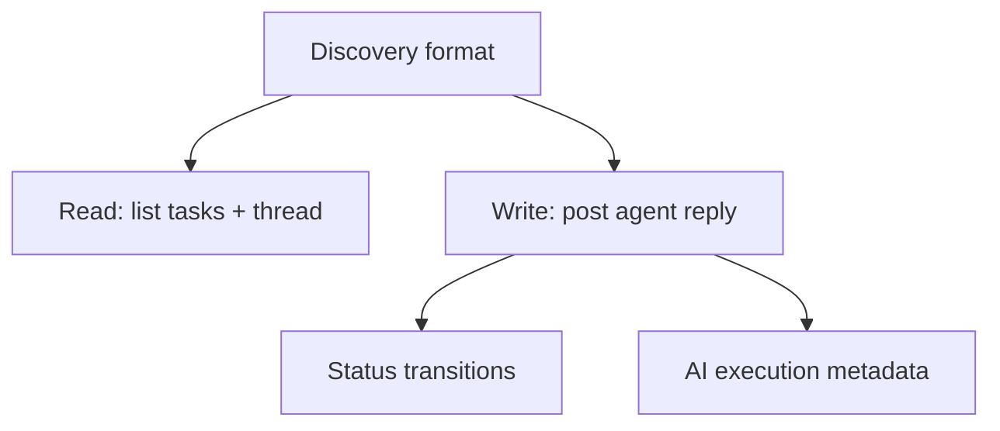

# Phase 4 — AI Agent Contract

## Goal

Define a provider-agnostic contract so any AI agent (Claude, Codex, Gemini, Cursor, Windsurf, custom) can discover open tasks, read threads, post replies, record execution metadata, and update status — without hardcoding a single provider.

## Scope

In scope:

- A documented, versioned discovery format for open tasks and threads.
- A read path: list open tasks and fetch a task's thread.
- A write path: post a reply as an agent.
- Status transitions an agent may perform (resolved, requires_review).
- AI execution metadata record (execution id, agent, timestamp, files, ranges, summary, reason).

Out of scope:

- Diff preview UI (Phase 5).
- Built-in provider execution — the contract is provider-neutral.

## Subtask Breakdown

## Acceptance Criteria

- An external agent can enumerate open tasks and read a thread via the contract.
- An agent can append a reply attributed to its name and type.
- An agent can mark a task resolved or requires_review.
- Execution metadata is persisted and linked to the message.
- The contract is documented and versioned; no provider is hardcoded.
- `npm run check` passes.

## Dependencies

- Phases 1–3.
