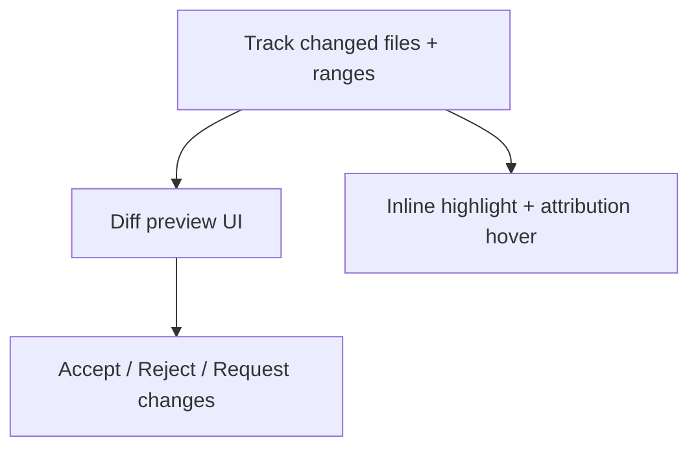

# Phase 5 — AI Change Preview

## Goal

When an AI agent modifies code for a task, let the user review those changes: see modified files and ranges, view a diff, and accept, reject, or request changes. Highlight AI-modified code inline with attribution.

## Scope

In scope:

- Capture files and ranges changed by an AI execution.
- Diff preview of AI changes for a task.
- Accept / reject / request-changes flows.
- Inline highlight of AI-modified ranges with a "Changed by <agent>" hover.

Out of scope:

- Git-level rename/merge handling (Phase 6).

## Subtask Breakdown

## Acceptance Criteria

- AI-modified files and ranges are recorded against the execution.
- The user can open a diff preview for those changes.
- Accept, reject, and request-changes each update task state and history.
- AI-modified ranges are visually highlighted with agent attribution on hover.
- `npm run check` passes.

## Dependencies

- Phase 4 (execution metadata).
