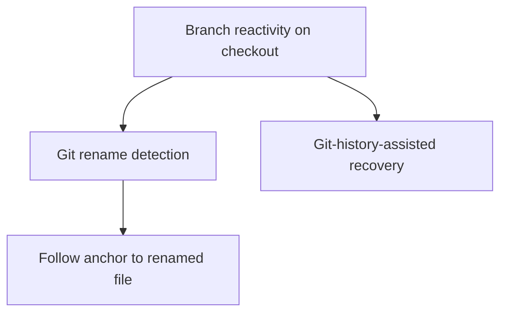

# Phase 6 — Git-Aware Recovery

## Goal

Use Git to make anchoring and task data resilient across real version-control workflows, and make the extension **react to branch switches**. Comments stay strictly per-branch: there is no cross-branch history merging.

## Scope

In scope:

- **Branch reactivity** — watch `.git/HEAD` (and the active branch) so switching branches via `git checkout` refreshes the sidebar, gutter decorations, and open threads to show the new branch's comments.
- Detect file renames via Git and follow the anchor to the new path.
- Use Git history as an additional anchor-recovery signal.

Out of scope:

- Cross-branch history merging or parent-branch carry-over (strict per-branch; team sync is a future opt-in).
- Remote/team sync (future, beyond this roadmap).

## Subtask Breakdown

## Acceptance Criteria

- Switching branches refreshes the sidebar and decorations to show only the new branch's comments.
- Renaming a file in Git keeps its tasks attached (anchor `filePath` follows the rename).
- Git history improves recovery for relocated code.
- `npm run check` passes.

## Dependencies

- Phase 2 (anchoring), Phase 1 (storage, branch scoping).
