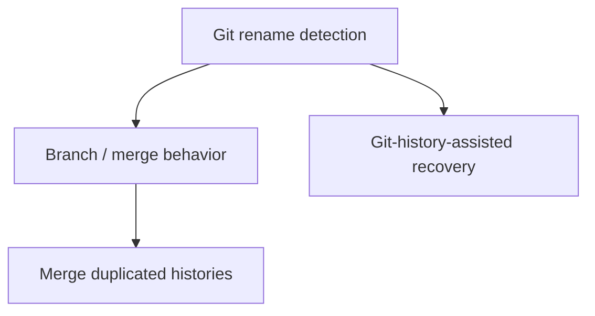

# Phase 6 — Git-Aware Recovery

## Goal

Use Git to make anchoring and task data resilient across real version-control workflows: file renames, branch switches, merges, and duplicated tasks across branches.

## Scope

In scope:

- Detect file renames via Git and follow the anchor to the new path.
- Sensible behavior on branch switches and merges.
- Merge duplicated task histories when the same task appears on multiple branches.
- Use Git history as an additional anchor-recovery signal.

Out of scope:

- Remote/team sync (future, beyond this roadmap).

## Subtask Breakdown

## Acceptance Criteria

- Renaming a file in Git keeps its tasks attached.
- Switching and merging branches does not lose or corrupt tasks.
- Duplicated tasks across branches are detected and their histories merged.
- Git history improves recovery for relocated code.
- `npm run check` passes.

## Dependencies

- Phase 2 (anchoring), Phase 1 (storage, branch scoping).
