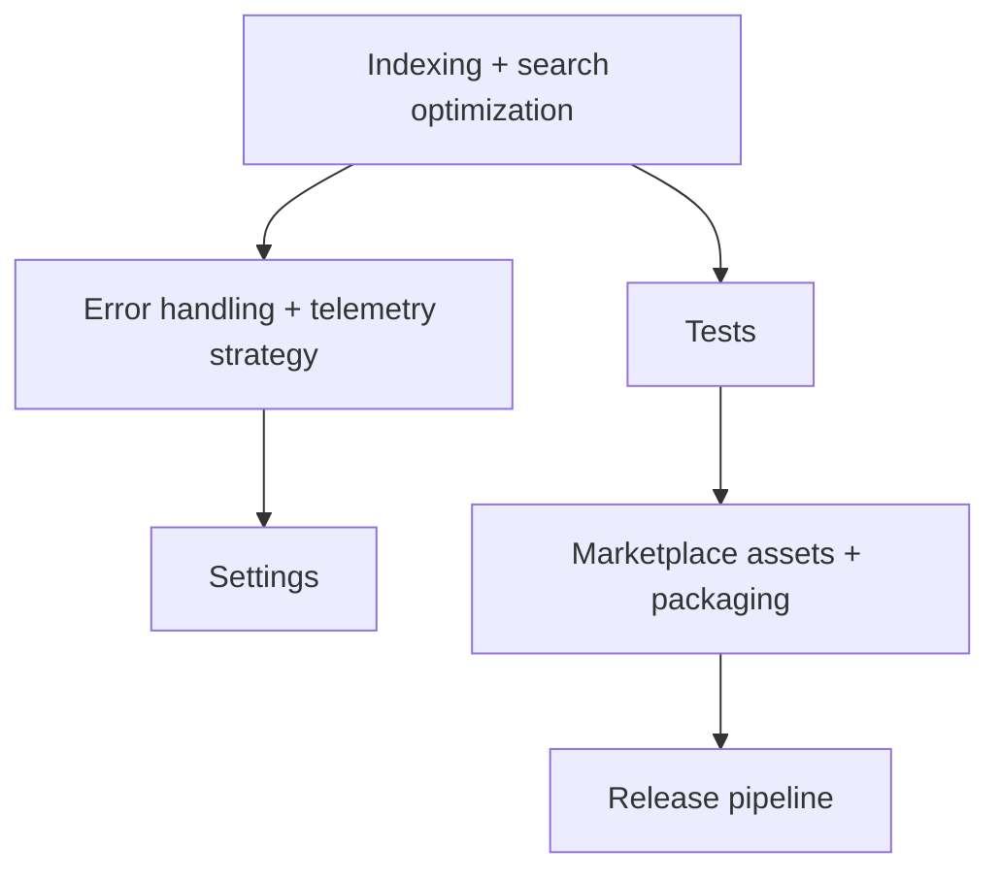

# Phase 7 — Scale & Marketplace Readiness

## Goal

Make the extension fast at scale and ready to publish: efficient indexing and search, tests, settings, robust error handling, packaging, and a release pipeline.

## Scope

In scope:

- Indexing and search optimization for large task counts and monorepos.
- Automated tests.
- Error handling and a telemetry strategy (opt-in, privacy-respecting).
- User-facing settings.
- Marketplace assets (icon, README, categories) and `.vsix` packaging.
- Release pipeline.

Out of scope:

- External integrations (GitHub/Jira/Linear/Slack) — tracked as future features in the product plan.

## Subtask Breakdown

## Acceptance Criteria

- Search and decoration updates stay responsive with 10,000+ tasks.
- A meaningful automated test suite runs in CI.
- Failures are handled gracefully; telemetry (if any) is opt-in.
- Settings are documented and respected.
- A `.vsix` can be built and the extension is Marketplace-ready.
- `npm run check` passes.

## Dependencies

- All prior phases.
